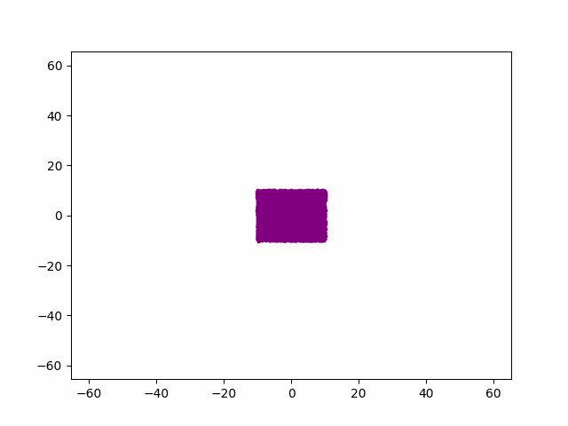

# Lab #1 Sharunov Kostin

## Generate gif image for 10000 body 100 cycles

## Performance results:
### Test computer config:
- CPU: 4 cores / 8 threads
- Iterations: 100

| thread\ bodies | 100       | 1000      | 10000      |
|----------------|-----------|-----------|------------|
| 1              | 0.058000s | 0.730000s | 36.495000s |
| 2              | 0.064000s | 0.580000s | 28.598000s |
| 4              | 0.070000s | 0.557000s | 23.592000s |
| 8              | 0.093000s | 0.576000s | 21.446000s |